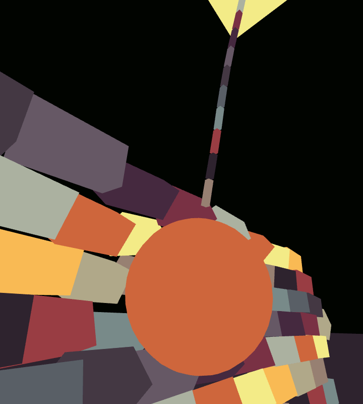

# lovr-phywire

Library for visualizing and debugging [LÖVR](https://lovr.org/) physics.

In LÖVR framework the rendering is completely decoupled from physics simulation. User should query the physics sim for position and orientation of each collider (and each shape inside each collider) and render everything themselves. This library makes it easy to render any project that uses physics, and also helps with finding issues in rigging of colliders and joints.

```Lua
phywire = require 'phywire'
world = lovr.physics.newWorld()
-- (create some colliders)

function lovr.draw(pass)
  phywire.draw(pass, world, phywire.render_shapes)  -- render solid geometry
  -- phywire.draw(pass, world)                      -- render in-depth visualizations
end
```

Aside from simple rendering of colliders, the library can visualize the physical simulation in various ways:

* draw wireframe shapes over previously rendered scene
* draw velocity vectors for each moving collider
* show angular velocity gizmos around each collider
* visualize the joints between colliders
* show information on collision contacts
* save and restore a snapshot of physics state



## Terrain and mesh

The geometry of terrain and mesh shape types cannot be fetched back once the shape has been created. To render these geometries in phywire you will need to attach the rendering objects to the shape's userdata. Two rendering methods are supported: the Model object, or an object with a `draw(pass, transform)` method.

```Lua
model = lovr.graphics.newModel(filename)
vertex_list, triangle_list = model:getTriangles()
mesh = world:newMeshCollider(vertex_list, triangle_list)
mesh:setUserData(model)

terrain = world:newTerrainCollider(...)
terrain:setUserData( {draw = terrain_draw_fn} )
```

If using [lovr-procmesh](https://github.com/jmiskovic/lovr-procmesh), the 'solid' representation has a suitable `draw()` method so it can be directly used as userdata.

If phywire encounters any mesh or terrain data that does not have the render objects attached, those shapes will be skipped with a warning message produced in the console output.

## Customization

The third argument in `phywire.draw(pass, world, options)` receives a table with rendering *options*. When options are omitted, all the visualizations are utilized and the wireframe overdraw mode is selected.

Any visualization can be disabled by overriding some options:

```Lua
phywire.draw(pass, world, {
  show_shapes = true,           -- draw collider shapes
  show_velocities = true,       -- vector showing direction and magnitude of collider linear velocity
  show_angulars = true,         -- gizmo displaying the collider's angular velocity
  show_joints = true,           -- show joints between colliders
  show_contacts = true,         -- show collision contacts (quite inefficient, triples the needed collision computations)
})
```

The `wireframe` flag is used to render shapes in wireframe mode. The `overdraw` flag disables the depth buffer test. This allows for some useful combinations.

* `{wireframe=false, overdraw=false}` draws solid geometry, provides quick and simple replacement for rendering of "physical" scene
* `{wireframe=true, overdraw=true}` renders on top of already drawn scene, this allows users to make sure their rendering is aligned with the physics state
* `{wireframe=true, overdraw=false}` renders wireframe visualizations but respects existing scene geometry (visuals introduce less noise, more usable for VR)


Various other options can be overridden, things like the size of each visualization type, sensitivities, and gizmo colors. Check the `m.options` table for more info.

The `phywire.render_shapes` table holds a preset for drawing the solid geometry of shapes without any other debugging visualizations; it can be given in place of *options* table.

## Controlling colors

The phywire visualization assigns different colors for each shape. To start off with, these colors are assigned from an internal palette by default, which is a quickest way for user to visualize their colliders. Going on from here there are few more options for having more control over color choices.

Second easiest option is to replace the internal palette and bring in a new set of colors. The shape colors will be chosen sequentially from the palette, which makes it hard to pick a color for each individual shape. To supply the custom palette, compose the nested list of colors pass it inside the `options.shapes_palette`. The list should have at least one color for a boring monochromatic look.

User can also specify individual colors for each shape. Phywire will try to look up `options.shape_colors[shape]` and if found that color will be used. Keys of this table are individual shapes, values are the colors used for that shape in `{r,g,b}` or hexcode format. The color can also be specified inside the shape's attached userdata using `shape:setUserData({color = {r,g,b})`. The userdata color is convenient because it can preserve colors across snapshots (see below).

## Snapshots

The current world state can be stored in a snapshot, and the snapshot can be used to re-create the state.

```Lua
snapshot = phywire.toSnapshot(world)
-- construct a new world from a saved snapshot
world = phywire.fromSnapshot(snapshot)
-- or add the snapshot into the already existing world
phywire.fromSnapshot(state, world)
```

The snapshot is a nested Lua table containing the complete data necessary to reconstruct the physics state:
* all the world parameters like gravity and velocity damping
* all colliders with current poses, velocities, parameters
* all the shapes in colliders, including their dimensions and parameters
* all the joints connecting the colliders

Because the snapshot is just a table of Lua primitives, it can easily be serialized and saved to disk.

```Lua
-- save/load using the `serpent` lib (not included)
lovr.filesystem.write('snapshot01.lua', serpent.block(snapshot))
snapshot_str = lovr.filesystem.read('snapshot01.lua')
ok, snapshot = serpent.load(snapshot_str)
if ok then
  world = phywire.fromSnapshot(snapshot)
end
```

Naturally, any references to colliders/shapes/joints in the physics world will need to be re-assigned after the snapshot is loaded.

**Limitations:** collider tags, mesh shapes and terrain shapes are not supported for snapshots. Tags will be ignored; unsupported shapes will be skipped after printing a warning in the console output.
