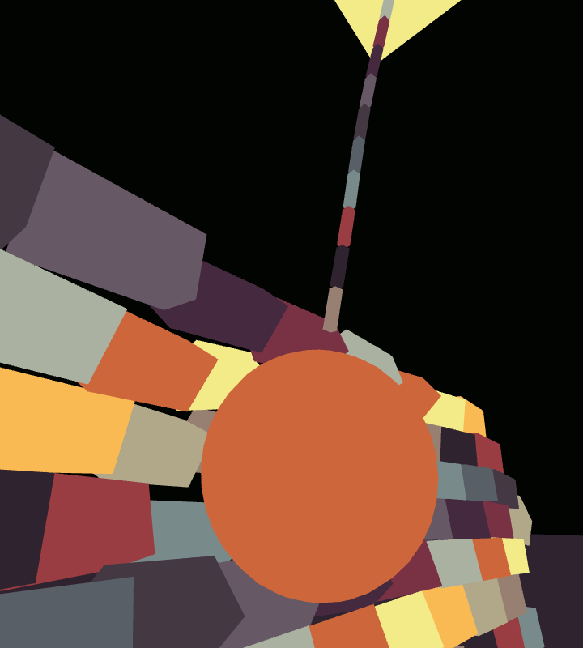

# lovr-phywire

Library for visualizing and debugging [LÖVR](https://lovr.org/) physics.

In LÖVR framework the rendering is completely decoupled from physics simulation. User should query the physics sim for position and orientation of each collider (and each shape inside each collider) and render everything themselves. This library makes it easy to render any project that uses physics, and also helps with finding issues in rigging of colliders and joints.

```Lua
phywire = require 'phywire'
world = lovr.physics.newWorld()
-- (create some colliders)

function lovr.draw(pass)
  phywire.draw(pass, world)             -- render with default visualization options (shapes only)
end
```

Aside from simple rendering of colliders, the library can visualize the physical simulation in various ways:

* draw wireframe shapes over previously rendered scene
* draw velocity vectors for each moving collider
* show angular velocity gizmos around each collider
* visualize the joints between colliders
* show information on collision contacts



## Terrain and mesh

The geometry of terrain and mesh shape types cannot be fetched back once the shape has been created. To render these geometries in phywire you will need to attach the rendering objects to the shape's userdata. Two rendering methods are supported: the Model object, or an object with a `draw(pass, transform)` method.

```Lua
model = lovr.graphics.newModel(filename)
vertex_list, triangle_list = model:getTriangles()
mesh = world:newMeshCollider(vertex_list, triangle_list)
mesh:setUserData(model)

terrain = world:newTerrainCollider(...)
terrain:setUserData( {draw = terrain_draw_fn} )
```

If using [lovr-procmesh](https://github.com/jmiskovic/lovr-procmesh), the 'solid' representation has a suitable `draw()` method so it can be directly used as userdata.

If phywire encounters any mesh or terrain data that does not have the render objects attached, those shapes will be skipped with a warning message produced in the console output.

## Customization

The third argument in `phywire.draw(pass, world, options)` receives a table with rendering *options*. When options are omitted, all the visualizations are utilized and the wireframe overdraw mode is selected.

Any visualization can be disabled by overriding some options:

```Lua
phywire.options.show_shapes = true           -- draw collider shapes (on by default)
phywire.options.show_velocities = true       -- vector showing direction and magnitude of collider linear velocity
phywire.options.show_angulars = true         -- gizmo displaying the collider's angular velocity
phywire.options.show_joints = true           -- show joints between colliders
phywire.options.show_contacts = true         -- show collision contacts (quite inefficient, triples the needed collision computations)
```

The `wireframe` flag is used to render shapes in wireframe mode. The `overdraw` flag disables the depth buffer test. This allows for some useful combinations.

* `wireframe=false, overdraw=false` draws solid geometry, provides quick and simple replacement for rendering of "physical" scene
* `wireframe=true, overdraw=true` renders on top of already drawn scene, this allows users to make sure their rendering is aligned with the physics state
* `wireframe=true, overdraw=false` renders wireframe visualizations but respects existing scene geometry (visuals introduce less noise, more usable for VR)


Various other options can be overridden, things like the size of each visualization type, sensitivities, and gizmo colors. Check the `m.options` table for more info.

## Controlling colors

The phywire visualization assigns a color for each shape. By default these colors are chosen from an internal palette, which is a quickest way to visualize colliders in lovr project. Going on from here there are few more options for having more control over color choices.

Second easiest option is to replace the internal palette and bring in a new set of colors. The shape colors will be chosen sequentially from the palette, which makes it hard to control the color for each individual shape. To use the custom color palette, compose the nested list of colors and assign the `options.shapes_palette` to that table. The list can contain just one color, which results in monochromatic rendering of all the shapes.

User can also specify individual colors for each shape. Phywire will try to look up `options.shape_colors[shape]`. If found, that color will be used. Keys of the `shape_colors` table are individual shapes, values are the colors used for that shape in `{r,g,b}` or hexcode format. For example, `phywire.options.shape_colors[my_shape] = 0xff00ff` will specify manual color for a single element.
