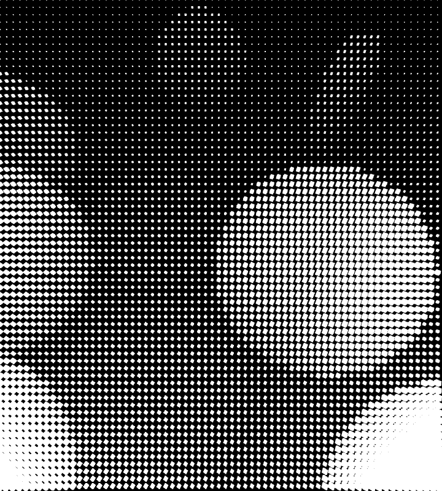

# lovr-phywire

Library for visualizing and debugging [LÖVR](https://lovr.org/) physics.

In LÖVR framework the rendering is completely decoupled from physics simulation. Devs should query the physics sim for position and orientation of each collider (and each shape inside each collider) and render everything themselves. This library makes it easy to render any project that uses physics, and also helps with finding issues in rigging of colliders and joints.

```Lua
phywire = require 'phywire'
world = lovr.physics.newWorld()
-- (create some colliders)

function lovr.draw(pass)
  phywire.draw(pass, world)             -- render with default visualization options (shapes only)
end
```

Aside from simple rendering of colliders, the library can visualize the physical simulation in various ways:

* draw wireframe shapes over previously rendered scene
* draw velocity vectors for each moving collider
* show angular velocity gizmos around each collider
* visualize the joints between colliders
* show information on collision contacts


### Managing the drawing of shapes

It is possible to customize the drawing of each collider instance and also of each shape instance. When specified, the user draw function will be called, instead of drawing the built-in basic shapes.

```Lua
phywire.setDraw(shape_or_collider,
  function(pass, pose)
  end)
```

After it is set, phywire will call given draw function instead of drawing shapes for this instance.

Some instances can also be marked to be skipped. This is useful for sensors or parts of the scene that are rendered by another system.

```Lua
phywire.setIgnored(shape_or_collider)      -- phywire will not draw this instance
```

### Unsupported shapes

Current phywire limitation is that drawing of terrain and mesh shapes is not supported. There is no way to fetch back the necessary data from physics engine after the shape has been created. To render the static meshes or terrain, you could supply a custom draw function:

```Lua
mesh = lovr.graphics.newMesh(--[[ ... ]])
collider = world:newMeshCollider(mesh)
phywire.setDraw(collider,
  function(pass, pose)
    pass:draw(mesh)
  end)
```

If phywire encounters any mesh or terrain data that does not have the specified rendering functions, those shapes will be skipped with a warning message produced in the console output.

### Rendering options

The pyhwire rendering can be precisely controlled to turn features on and off, or to adjust the parameters. Here are the available rendering options and their defaults.

```Lua
phywire.options.wireframe = false        -- show shapes in wireframe instead of filled geometry
phywire.options.overdraw = false         -- force elements to render over existing scene (ignore depth buffer check)
phywire.options.show_shapes = true       -- draw collider shapes (mesh and terrain not supported!)
phywire.options.show_outlines = false    -- draw a thin outline around shapes, inked as darker tint of shape's color
phywire.options.show_aabb = false        -- draw each shape's axis-aligned boundary box
phywire.options.show_velocities = false  -- vector showing direction and magnitude of collider linear velocity
phywire.options.show_angulars = false    -- gizmo displaying the collider's angular velocity
phywire.options.show_joints = false      -- show joints between colliders
```

The `wireframe` flag is used to render shapes in wireframe mode. The `overdraw` flag disables the depth buffer test. This allows for few interesting combinations.

* `wireframe=false, overdraw=false` draws solid geometry, provides quick and simple way to render solid objects
* `wireframe=true, overdraw=true` renders the wireframe on top of already drawn scene, to visually inspect that the visuals are aligned with the physics scene
* `wireframe=true, overdraw=false` renders wireframe visualizations but respects existing scene geometry (visuals are less noisy, more usable for VR)

Various other options can be overridden, parameters like the visual sizes and colors of each visualization type, velocity indicator sensitivity, parameters controlling the outline rendering, etc. Check the `m.options` table at start of `phywire.lua` to learn about them.

### Controlling colors

The phywire visualization assigns a color for each shape. By default these colors are chosen from an internal palette, which is a quickest way to visualize colliders in a fresh lovr project. Going on from here there are few more options for having more control over color choices.

Second easiest option is to replace the internal palette and bring in a new set of colors. To use the custom color palette, compose the nested list of colors and assign it to the `options.shapes_palette`. The list can contain just one color, which results in monochromatic rendering of all the shapes. The shape colors will be chosen sequentially from the palette, which makes it hard to control the color for each individual shape.

Ultimately you can also specify specific colors for each collider or each individual shape with `phywire.setColor(shape_or_collider, color)`. The `color` can be `{r,g,b}` table or hexcode format.

### Troubleshooting with x-ray

While `phywire.draw` tries to provide a comprehensive and correct visualization of your physics simulation, sometimes it's helpful to peek behind the curtain and see things as the physics engine sees them. That's where the `xray()` function comes in handy.

This drawing function casts many rays from the screen into the physics scene, and checks for collisions with colliders in the world. By drawing many tiny cube "pixels" at each hit point, it shows a direct and raw representation of your collider exact geometry in the physics world scene. Use it as a low-level inspection tool when you suspect inconsistencies between the rendered representation and the actual physics simulation.



To put it into action, replace your `phywire.draw` call with `phywire.xray(pass, world, resolution)`. Resolution is optional (default is 0.01, 100x100 raster grid) and can be used to control the trade-off between the speed and the visual fidelity.


## Scene interaction

The phygrab is a separate module that implements a generic mouse cursor interaction with all non-kinematic colliders. You can grab the collider with right mouse button and then drag it around and release it. The mouse wheel can push the grabbed collider closer or farther to the camera.

The module offers a quick way to integrate it into any project. Simply place `require('phygrab').integrate(world)` at the end of the `main.lua` file or in your `lovr.load()` function. A more clean and maintainable way of usage is to call *phygrab*'s' `draw`, `mousepressed`, `mousereleased` and `wheelmoved` functions from the implemented LÖVR's callbacks.

The module uses right mouse button by default as the left mouse button is often mapped to the camera rotation. If left mouse is preferred, use `phygrab.mouse_button = 1`.

## Older LÖVR version

Older LÖVR versions (v.17 and back) use a different physics engine and the physics API is a bit different. The variant that supports it is on the `ode` branch.
